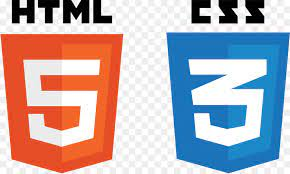
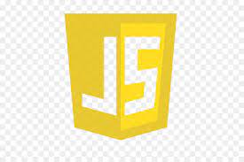

# Louise Briquet - 28 ans - *Web Developper en devenir* :rocket: 
---

### Présentation  

Actuellement en formation au sein de l'école [O'clock](https://oclock.io/?utm_source=google&utm_medium=cpc&utm_campaign=Brand&adgroupname=Oclock&keyword=oclock&gclid=Cj0KCQjw1ZeUBhDyARIsAOzAqQIg8-_uKn1_JbTOEpGEgn9AklEQAPNn_C-kGvkPw9zpkt6k2nu-XcMaAtmQEALw_wcB) jusqu'au mois de septembre, j'aimerai par la suite pouvoir mettre un pied dans le monde merveilleux du développement Web. :computer: 

Sérieuse, autonome, appliquée, je saurai exploiter toutes mes connaissances et en engranger de nouvelles.   

La formation que je suis, a l'avantage de nous préparer aux missions en entreprise, nous avons l'habitude de travailler en pair programming, nous avons également appris à utiliser GitHub et Trello. 

### Compétences  

#### A venir...

React
Symfony

